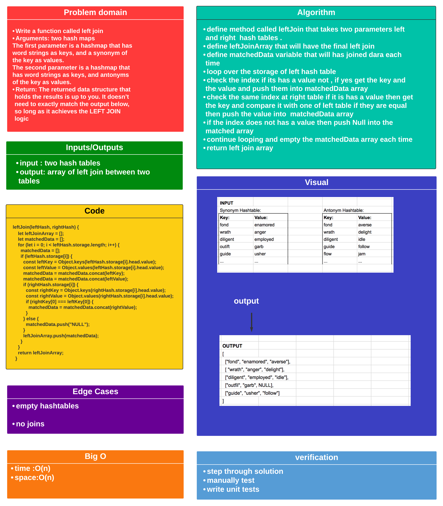

# Code Challenge: Class 33 / hashmap-left-join :

## Challenge

### create a method called leftJoin that is takes two hashmaps and returns new data, all left hash and the matching ones from right hash.

## Approach

* ### I understood the problem first
* ### I imagined how the results should be
* ### I made a drawings of how the hashTable would be after insertion of multiple key and values.
* ### I wrote the code
* ### I made the tests

## Efficiency

* ### time : O(n) 
* ### space : O(n) 

## API

* ### Hashtable

  - leftJoin(leftHash, rightHash)  : This method LEFT JOINs two hashmaps into a single data structure.

## Testing

### [Tests](./__test__)

## Javascript Implementation /The Code 

### [Code](./hashmap-left-join.js)