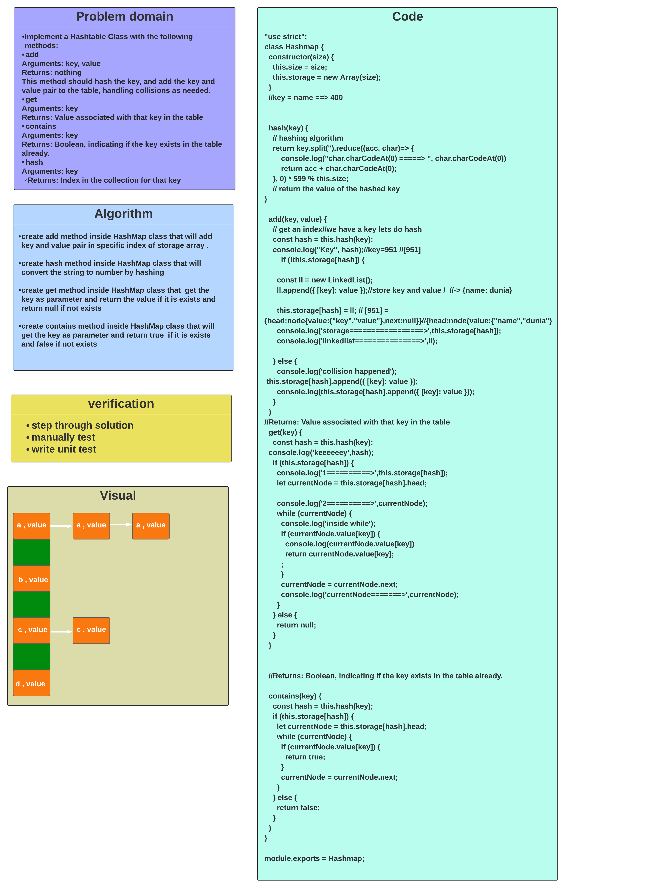
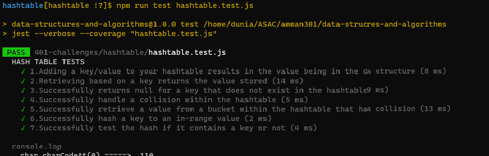
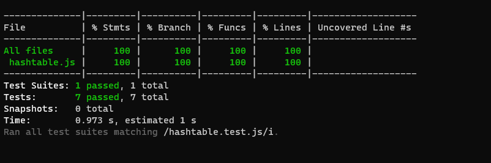

# Code Challenge: Class 30 / Hashtables

# Hashtables

### Hashtable is an array of a list. Each list is known as a bucket. The position of the bucket is identified by calling the hash() method. A Hashtable contains values based on the key.

## Challenge

### create Hashtable class implements a hashtable, which maps keys to values. It inherits Dictionary class and implements the Map interface.

## Approach

* ### I understood the problem first
* ### I imagined how the results should be
* ### I made a drawings of how the hashTable would be after insertion of multiple key and values.
* ### I wrote the code
* ### I made the tests

## Efficiency

* ### O(1) time complexity for lookups
* ### space : O(n) 

## API

* ### add(key, value)

takes in both the key and value, hashes the key, and adds the key and value pair to the table, handling collisions as needed

* ### get(key)

takes in the key and returns the value from the table or an array of values if the key has multiple pairs

* ### contains(key)

takes in the key and returns a boolean, indicating if the key exists in the table already

* ### hash(key)

takes in an arbitrary key and returns an index in the collection

## Testing

### [Tests](./__test__/hashtable.test.js)

## Javascript Implementation /The Code 

### [Code](./hashtable.js)