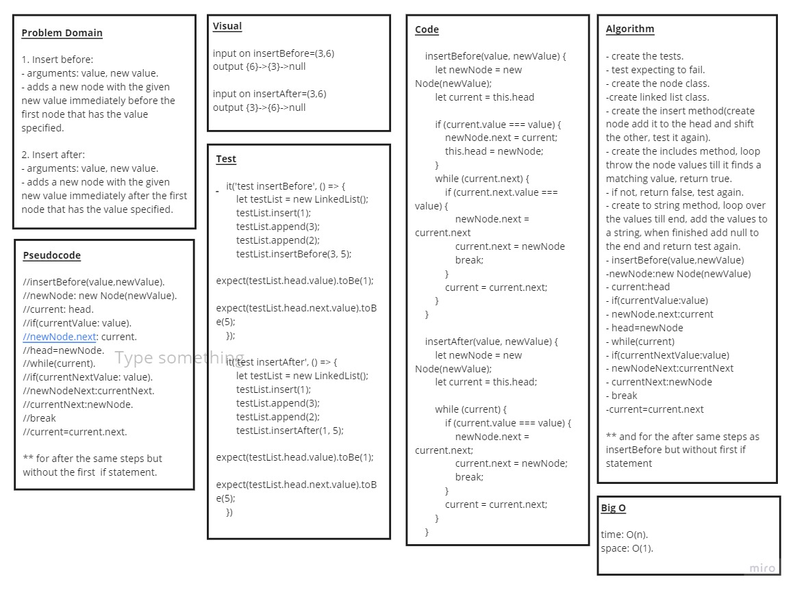

# Code Challenge: Class 06 / linked-list-insertions 

## Challenge Description
### build a new methods for linked list

### append(value) which adds a new node with the given value to the end of the list insertBefore(value, newVal) which add a new node with the given newValue immediately before the first value node insertAfter(value, newVal) which add a new node with the given newValue immediately after the first value node

## Challenge 

* ### create a Node class that has properties for the value stored in the Node, and a pointer to the next Node.

* ### Create a Linked List class with the following properties:

    * ### append : an new node with given value to the end of the list
    * ### insertBefore : adds a new node with give value before specified value node.
    * ### insertAfter : adds a new node with give value after specified value node.

* ### add tests to the code to test for the following:
### 1.Can successfully add a node to the end of the linked list
### 2.Can successfully add multiple nodes to the end of a linked list
### 3.Can successfully insert a node before a node located i the middle of a linked list
### 4.Can successfully insert a node before the first node of a linked list
### 5.Can successfully insert after a node in the middle of the linked list
### 6.Can successfully insert a node after the last node of the linked list

## Approach & Efficiency :

* ###  understood the problem first
* ### I imagined how the results should be
* ### I made a drawings of how the linked list would be after insertion of multiple nodes Linked-List.
* ### I wrote the code
* ### I made the tests

## API
* ### append(): appends an new node with given value to the end of the list.

* ### insertBefore(): adds a new node with give value before specified value node.

* ### insertAfter(): adds a new node with give value after specified value node.

## The Code :
### [Code](https://github.com/saleem-ux/401-data-structures-and-algorithms/tree/main/linked-list-insertions)

## Test
### npm run test 
