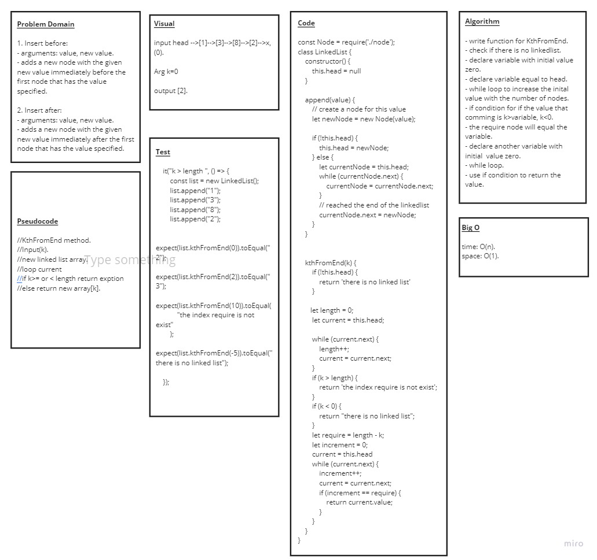

# Code Challenge: Class 07 / linked-list-kth

## Challenge Description

### Write a method for the Linked List class which takes a number, k, as a parameter. Return the node’s value that is k from the end of the linked list. You have access to the Node class and all the properties on the Linked List class as well as the methods created in previous challenges.

## Challenge 

* ### create a Node class that has properties for the value stored in the Node, and a pointer to the next Node.

* ### Create a Linked List class with the following properties:

    * ### insert : Adds a new node with that value to the head of the list with an O(1) Time performance.
    * ### include : checks if a value in the list exist
    * ###  toString : returns all the nodes in a list in a String format.
    * ### append : an new node with given value to the end of the list
    * ### insertBefore : adds a new node with give value before specified value node.
    * ### insertAfter : adds a new node with give value after specified value node.
    * ### kthFromEnd : k-th value from the end of a linked list.

* ### unit tests:

### 1. Where k is greater than the length of the linked list

### 2. Where k and the length of the list are the same

### 3. Where k is not a positive integer

### 4. Where the linked list is of a size 1

### 5. “Happy Path” where k is not at the end, but somewhere in the middle of the linked list

## Approach & Efficiency 

### **Approach**:
   * ### understood the problem first
   * ### I imagined how the results should be
   * ### I made a drawings of how the linked list would be after insertion of multiple nodes Linked-List.
   * ### I wrote the code
   * ### I made the tests

### **Efficiency**:
   * ### Space : linkedList : O(n)
   * ### Time : space : O(1) time :O(n)

## API
* ### Insert(): which takes value of type any adding new node with the input value to the list.

* ### include(): this method compare input value if it's exist in linked list.

* ### toString(): return a string visualizing the linked list shape.

* ### append(): appends an new node with given value to the end of the list.

* ### insertBefore(): adds a new node with give value before specified value node.

* ### insertAfter(): adds a new node with give value after specified value node.

* ### kthFromEnd(): takes k as input and return the node value for that number.

## The Code :
### [Code](https://github.com/Duniaalkilany/data-structures-and-algorithms/tree/main/401-challenges/linked-list-kth/linked-list-kth.js)

## Test
### npm run test 
