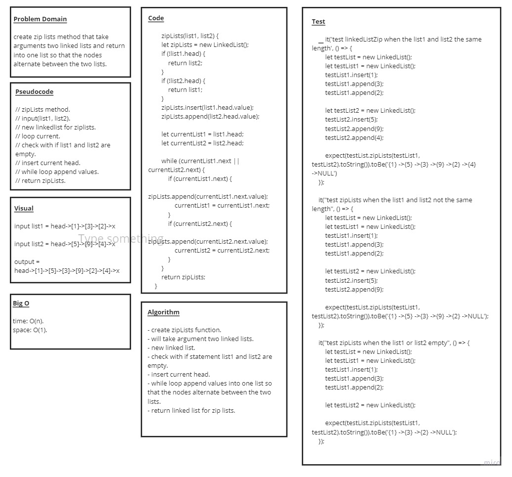
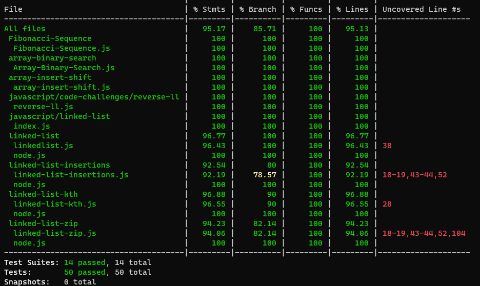

# Code Challenge: Class 08 / Linked List Zip

## Challenge Description

### Write a function called zipLists which takes two linked lists as arguments. Zip the two linked lists together into one so that the nodes alternate between the two lists and return a reference to the head of the zipped list. Try and keep additional space down to O(1). You have access to the Node class and all the properties on the Linked List class as well as the methods created in previous challenges

## Approach & Efficiency :

* ###  understood the problem first
* ### I imagined how the results should be
* ### I made a drawings of how the linked list would be after insertion of multiple nodes Linked-List.
* ### I wrote the code
* ### I made the tests

## API
* ### append():zipList(): takes two linked lists as arguments and zip them together so that the nodes alternate between the two lists and return a reference to the head of the zipped list.

## The Code :
### [Code](https://github.com/Duniaalkilany/data-structures-and-algorithms/tree/main/401-challenges/linked-list-zip)

## Test
### npm run test 

