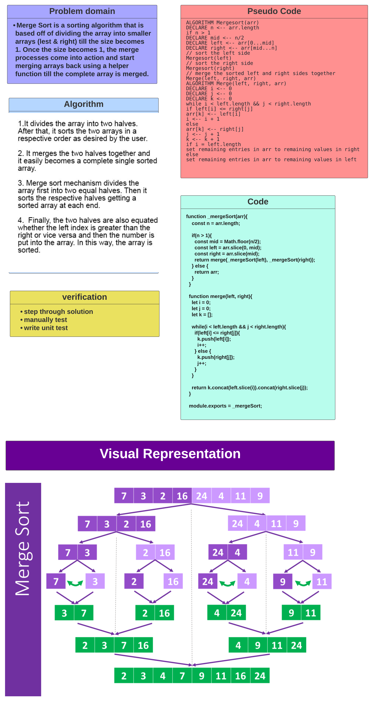

# Code Challenge: Class 29 / Merge Sort - JS Implementation

## By Saleem Diab

## Introduction

### Merge Sort is a sorting algorithm that splits up the values of an array and then merges them in a sorted order. It is a very efficient sorting algorithm - O(n log n).

## Efficiency

* ### Time: O(n log n)

* ### Space: O(n)

## The code :

[code](./mergeSort.js)

## Tests :

