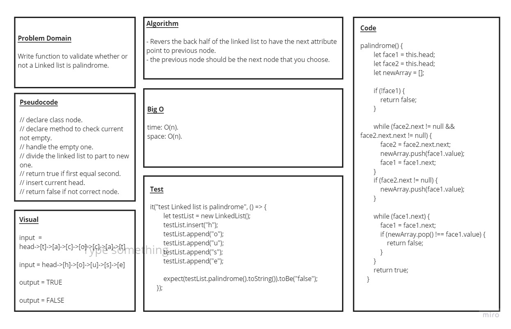

# Code Challenge: Class 09 / linked-list-Palindrome

## Challenge Description

### Write a function to validate whether or not a Linked list is palindrome

## Challenge

* ### create a Node class that has properties for the value stored in the Node, and a pointer to the next Node

* ### Create a Linked List class with the following properties

* ### insert : Adds a new node with that value to the head of the list with an O(1) Time performance

* ### include : checks if a value in the list exist

* ###  toString : returns all the nodes in a list in a String format

* ### append : an new node with given value to the end of the list

* ### insertBefore : adds a new node with give value before specified value node

* ### insertAfter : adds a new node with give value after specified value node

* ### Divide the linked list two part

* ### return true if first equal second part

* ### return false if not equal

## Approach & Efficiency

### **Approach**

* ### understood the problem first

* ### I imagined how the results should be

* ### I made a drawings of how the linked list would be after insertion of multiple nodes Linked-List

* ### I wrote the code

* ### I made the tests

### **Efficiency**

* ### Space : linkedList : O(n)

* ### Time : space : O(1) time :O(n)

## API

* ### Insert(): which takes value of type any adding new node with the input value to the list

* ### include(): this method compare input value if it's exist in linked list

* ### toString(): return a string visualizing the linked list shape

* ### append(): appends an new node with given value to the end of the list

* ### insertBefore(): adds a new node with give value before specified value node

* ### insertAfter(): adds a new node with give value after specified value node

* ### palindrome(): A palindrome is a word, phrase, number, or sequence of nodes which reads the same backward as forward

## The Code

### [Code](https://github.com/saleem-ux/401-data-structures-and-algorithms/tree/main/palindrome)

## Test

### npm run test
