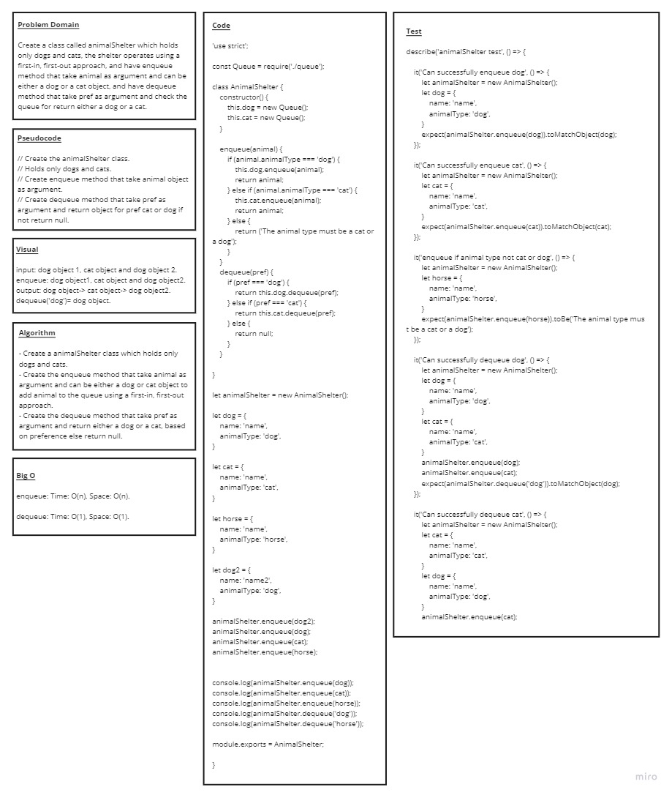

# Code Challenge: Class 12 / stack-queue-animal-shelter

# Challenge Summary

## Create a class called AnimalShelter which holds only dogs and cats. The shelter operates using a first-in, first-out approach

# Challenge Description

## Implement the following methods: enqueue(animal): adds animal to the shelter. animal can be either a dog or a cat object. dequeue(pref): returns either a dog or a cat. If pref is not "dog" or "cat" then return null

# Whiteboard Process

# Approach & Efficiency

* ###  understood the problem first

* ### I imagined how the results should be

* ### I wrote the code

  * ### make a constructor that creates a new array for each shelter

  * ### create a class "animal" with a constructor that handles the types of animals

  * ### write and enqueue method that creates a new animal and pushes it into the shelter

  * ### write a dequeue method that removes the first animal of specified pref

* ### I made the tests

### enqueue(value) time : o(n) , space O(n)

### dequeue() time : o(1) , space O(1)

# API

* ### enqueue(animal) : add object into the AnimalShelter, using a lastin last out approach

* ### dequeue(pref) : Removes the object from the front of the AnimalShelter

## Solution - Code

* ### [Code](https://github.com/saleem-ux/401-data-structures-and-algorithms/tree/main/stack-queue-animal-shelter)
