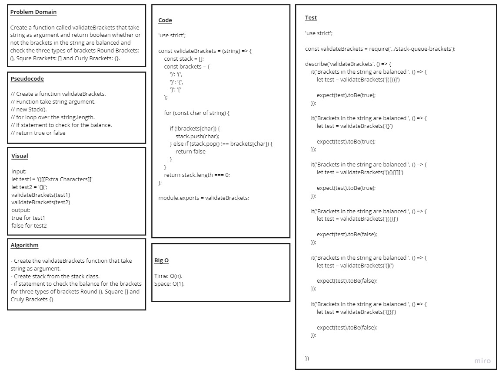

# Code Challenge: Class 13 / stack-queue-brackets

# Challenge Summary

## Your function should take a string as its only argument, and should return a boolean representing whether or not the brackets in the string are balanced. There are 3 types of brackets

* ## Round Brackets : ()

* ## Square Brackets : []

* ## Curly Brackets : {}

# Challenge Description

## Declare a stack that holds an array of opening parens declair an array to implement stack traverse the string expression using a for loop if the current character is an oening bracket then push it into the stack if the character is a closing bracket then pop it off the stack if popped character is the matching start bracket then parens are not balanced if there is some other bracket somehow left in stack, then brackets are not balanced

# Whiteboard Process

# Approach & Efficiency

* ###  understood the problem first

* ### I imagined how the results should be

* ### I wrote the code

* ### I made the tests

* ### validateBrackets(str) time : o(n) , space O(n)

# API

* ### validateBrackets(str) : check whether or not the brackets in the string are balanced

## Solution - Code

* ### [Code](https://github.com/saleem-ux/401-data-structures-and-algorithms/blob/main/stack-queue-brackets/stack-queue-brackets.js)
