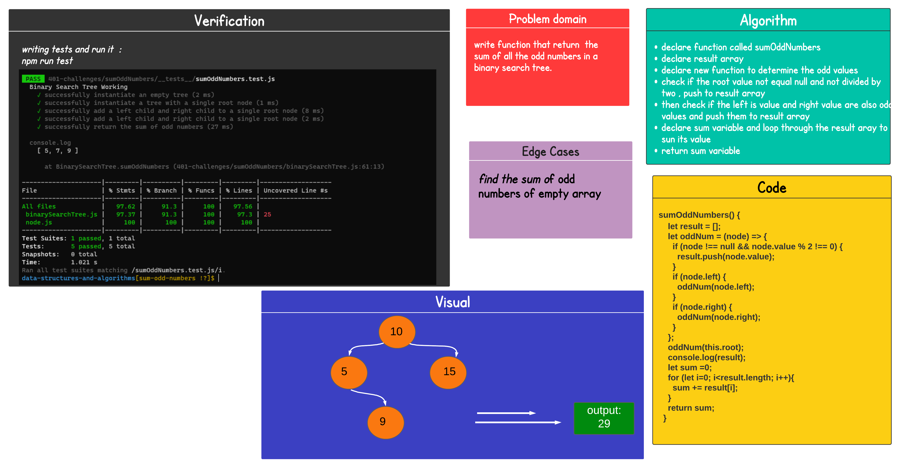

# Code Challenge: Class 19 / Sum-Odd-Numbers Traversal

## Challenge Summary

### Find the sum of all the odd numbers in a binary search tree

## Whiteboard Process

## Approach & Efficiency

* ###  understood the problem first

* ### I imagined how the results should be

* ### I wrote the code

* ### I made the tests

* ### breadthFirst(tree)

  * ###  time : O(n)  

  * ### space O(n)
  
## API

* ### summOddNumbers() : return the sum of odd numbers in the tree

## Code

* ### [Code](https://github.com/Duniaalkilany/data-structures-and-algorithms/tree/main/401-challenges/sumOddNumbers/binarySearchTree.js)
