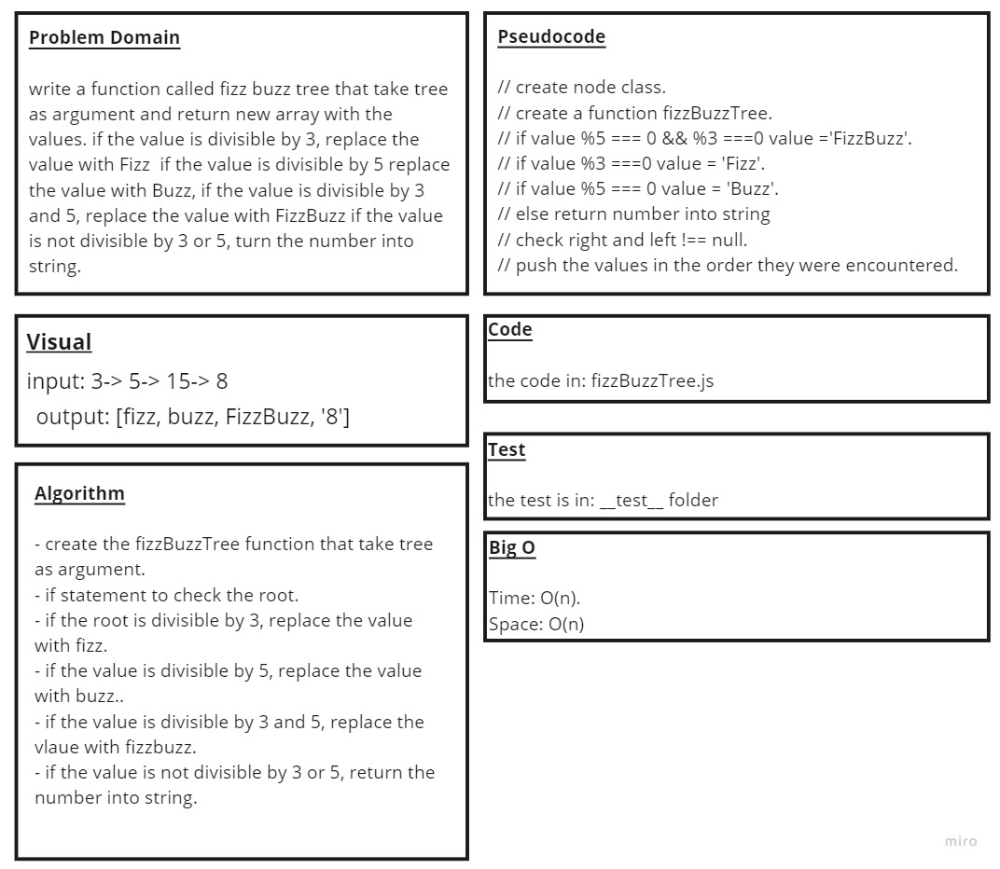

# Challenge Summary

* Write a function called fizz buzz tree that take tree as argument and return new array with the values If the value is divisible by 3, replace the value with “Fizz” If the value is divisible by 5, replace the value with “Buzz” If the value is divisible by 3 and 5, replace the value with “FizzBuzz” If the value is not divisible by 3 or 5, turn the number into a String.

## Whiteboard Process

## Approach & Efficiency

* the node class and the BinaryTree class is from last challenge

* i create the fizzBuzzTree function that take tree as argument

* then if statment to check the root

* if the root is divisible by 3, replace the value with “Fizz”

* If the value is divisible by 5, replace the value with “Buzz”

* If the value is divisible by 3 and 5, replace the value with “FizzBuzz”

* If the value is not divisible by 3 or 5,  turn the number into a String.

## Solution

* [the code](./fizzBuzzTree.js)

* to run the test npm test

* [the test](./__test__/fizzBuzzTree.test.js)