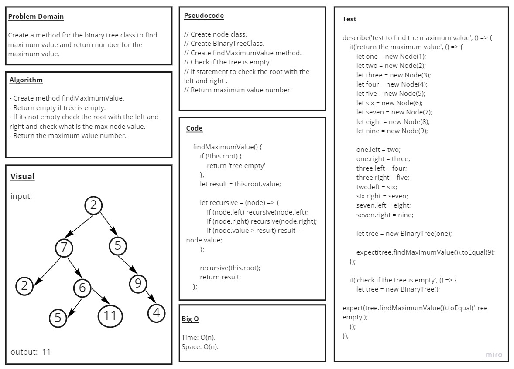

# Code Challenge 14: Tree-Max : Get Max Value:

## Challenge Summary

* create method for the Binary Tree class to find maximum value and return number for the maximum value

## Whiteboard Process

## Approach & Efficiency

* the node class and the BinaryTree class is from last challenge

* i create the findMaximumValue method

* check for the root and return empty if the tree is empty

* if its not empty check the root with the left and right and check what is the max node value

* then return the the maximum value number

## Solution

* [the code](./binaryTree.js)

* to run the test npm test

* [the test](./__test__/binaryTree.test.js)