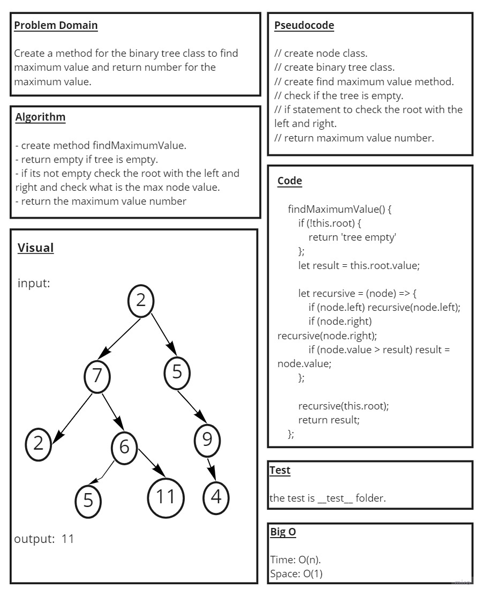

# Code Challenge: Class 16 / Tree-Max : Maximum Value in a Binary Tree

## Challenge Summary

### Function find the Maximum Value in a Binary Tree

## Whiteboard Process

## Approach & Efficiency

* ###  understood the problem first

* ### I imagined how the results should be

* ### I wrote the code

* ### I made the tests

* ### findmax() time : O(log n) , space O(1)

## API

* ### findmax(): Return maximum value stored in the tree

## Code

* ### [Code](https://github.com/saleem-ux/401-data-structures-and-algorithms/tree/main/tree-max)
