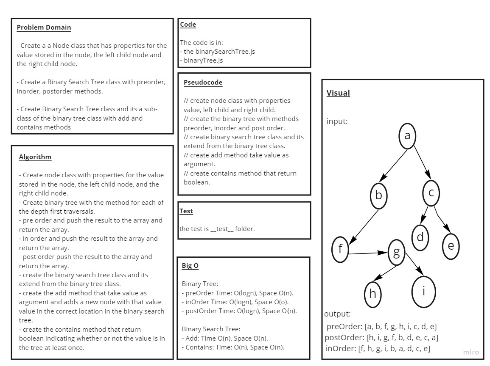

## Code Challenge: Class 15 / Trees : Binary Tree & Binary Search Tree

# Challenge Summary

### Write Binary and Binary Search trees class with their methods

## Whiteboard Process

## Approach & Efficiency

* ###  understood the problem first

* ### I imagined how the results should be

* ### I wrote the code

* ### I made the tests

* ### BinaryTree

  * ### preOrder() time : O(log n) , space O(n)
  * ### inOrder() time : O(log n) , space O(n)
  * ### postOrder() time : O(log n) , space O(n)

* ### BinarySearchTree

  * ### contains(value) : time : O(n) , space O(n)
  * ### add(value) : time O(n), spaceO(n)

## API

* ### Binary Tree

       preOder() : Root -> Left -> Right
       postOrder() : Left -> Right -> Root
       inOrder() : Left -> Root -> Right

* ### Binary Search Tree

      addValue(value) : add value to the tree

      contains(value) : check if the tree contains this value at least one time.

## Code

* ### [Code](https://github.com/saleem-ux/401-data-structures-and-algorithms/blob/main/trees/binaryTree.js)

* ### [Code](https://github.com/saleem-ux/401-data-structures-and-algorithms/blob/main/trees/binarySearchTree.js)

